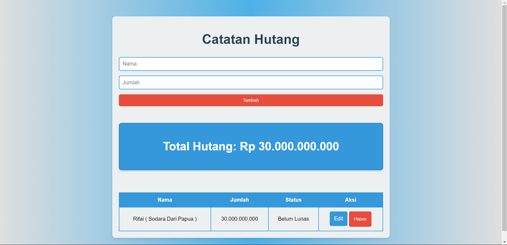

# Aplikasi Pencatat Hutang

Aplikasi Pencatat Hutang adalah aplikasi sederhana yang memungkinkan pengguna untuk mencatat dan mengelola hutang mereka. Aplikasi ini dibangun menggunakan HTML, CSS, dan PHP dengan SQLite sebagai database.

## Fitur

- Menambahkan hutang baru
- Mengedit hutang yang sudah ada
- Menghapus hutang
- Melihat daftar hutang



## Teknologi yang Digunakan

- **HTML**: Struktur dasar aplikasi
- **CSS**: Styling dan tampilan aplikasi
- **PHP**: Logika server-side
- **SQLite**: Database untuk menyimpan data hutang

## Prerequisites

Sebelum menjalankan aplikasi, pastikan Anda memiliki:

- Server lokal (seperti XAMPP atau MAMP) yang mendukung PHP
- PHP 7.0 atau yang lebih baru
- SQLite

## Cara Menggunakan

**Clone repository ini:**

   ```bash
   git clone https://github.com/RafifDwiPrayata/PencatatHutang.git
